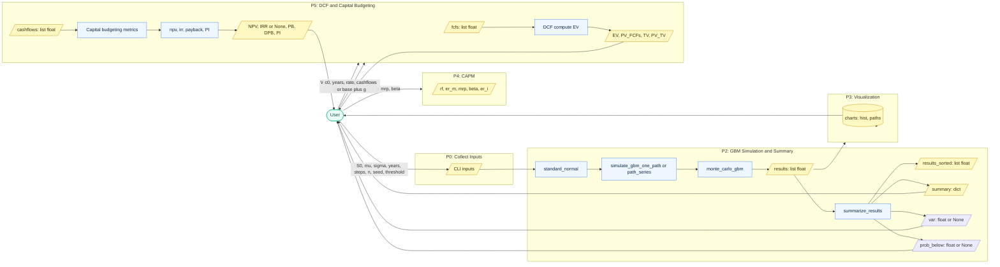

```mermaid
flowchart TB

    user([User (CLI)]):::ext
    menu([P0: Finance Toolbox CLI Menu]):::proc
    
    gbm([P2: GBM Monte-Carlo]):::proc
    sum([P2a: Summary and VaR]):::proc
    viz([P3: Visualization (Matplotlib)]):::proc
    capm([P4: CAPM Calculator]):::proc
    dcf([P5a: DCF Valuation]):::proc
    cb([P5b: Capital Budgeting]):::proc
    utils([Utilities: NPV, IRR, Payback, PI]):::store
    mem([In-memory data: lists, dicts, floats]):::store
    
    user -- "parameters: S0, mu, sigma, T, steps, n, seed, threshold; rf/beta; WACC/g; cashflows..." --> menu
    menu --> gbm
    menu --> capm
    menu --> dcf
    menu --> cb
    
    gbm -- "results list[float]; path list[float]" --> sum
    gbm -- "results; paths" --> viz
    sum -- "summary dict; VaR float or None; prob_below float or None" --> user
    viz -- "charts: histogram, sample paths" --> user
    
    capm -- "rf, er_m, mrp, beta, er_i" --> user
    dcf -- "EV; PV_FCFs; TV; PV_TV; optional equity/share" --> user
    cb --> utils
    utils --> cb
    cb -- "NPV; IRR or None; PB; DPB; PI" --> user
    
    gbm --- mem
    sum --- mem
    dcf --- mem
    cb --- mem
    
    classDef proc fill:#eef7ff,stroke:#3b82f6,stroke-width:1px,color:#0b2748;
    classDef store fill:#fef9c3,stroke:#ca8a04,stroke-width:1px,color:#3b2f0b;
    classDef ext fill:#ecfdf5,stroke:#10b981,stroke-width:1px,color:#064e3b;
```
